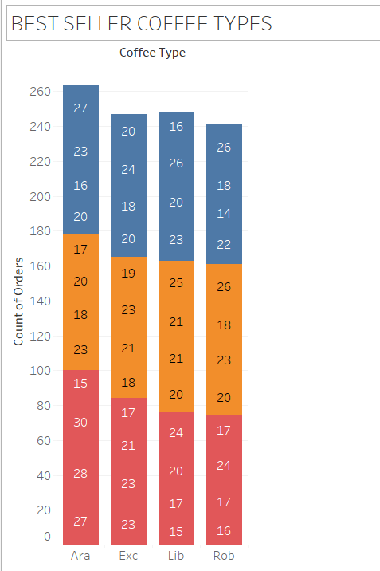
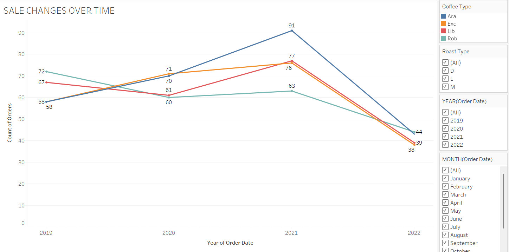
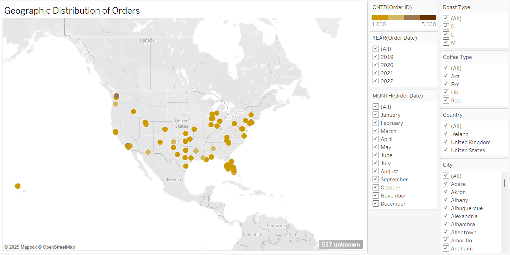
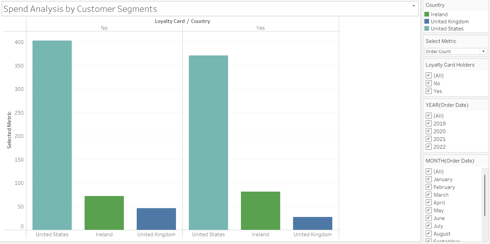
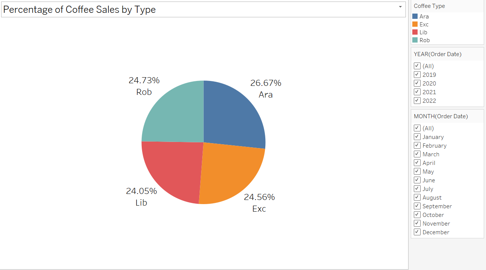

# Coffee Shop Data Analysis and Visualization

## 🌍 Project Overview

This project provides a comprehensive analysis of customer behavior and sales performance for a fictional coffee shop. Utilizing Tableau as the primary tool for data visualization, the project aims to reveal meaningful insights through interactive dashboards and visual elements. The analysis is based on three interconnected datasets: CUSTOMERS, ORDERS, and PRODUCTS.

---

## 📊 Objectives

* Identify the most popular coffee types and roast preferences.
* Understand how customer segments (e.g., loyalty card holders, countries) contribute to overall revenue.
* Monitor sales trends over time to detect seasonal patterns.
* Explore the geographical distribution of sales.
* Calculate dynamic sales percentages by product type.

---

## 📂 Datasets Used

### CUSTOMERS

* Customer ID (Primary Key)
* Customer Name
* Email, Phone Number
* Address, City, Country, Postcode
* Loyalty Card Status

### ORDERS

* Order ID (Primary Key)
* Order Date
* Customer ID (Foreign Key)
* Product ID (Foreign Key)
* Quantity

### PRODUCTS

* Product ID (Primary Key)
* Coffee Type (e.g., Arabica, Robusta)
* Roast Type (Light, Medium, Dark)
* Size (grams)
* Unit Price
* Price per 100g
* Profit per Unit

---

## 🔄 Data Preparation

* Joined ORDERS with CUSTOMERS using Customer ID.
* Joined ORDERS with PRODUCTS using Product ID.
* Cleaned data by handling nulls, formatting dates, and removing unnecessary columns.
* Created calculated fields such as "Total Sales" (`Quantity * Unit Price`).

---

## 📈 Visualizations

### 1. ☕ Most Popular Coffee Types

Shows order volume for each coffee type with color breakdowns by roast type.

---

### 2. 🔢 Sales Over Time

Displays yearly and monthly trends in order volumes by coffee type.

---

### 3. 🗺️ Geographic Distribution

Highlights cities and countries with highest order volumes using circle size and intensity.

---

### 4. 📅 Spending by Region & Loyalty

Compares profit and total sales by country and loyalty card status.

---

### 5. 🕀 Coffee Sales Percentage

Illustrates coffee sales distribution by type. Percentages update dynamically based on filters.

---

## 🔧 Technologies Used

* Tableau (Data Visualization)
* Excel/CSV (Data Source Format)
* GitHub (Version Control)

---

## 📅 Usage

1. Clone this repository.
2. Open the `.twbx` file in Tableau.
3. Interact with filters and parameters to explore insights.

---

## 📄 License

This project is for academic and portfolio use only.

---

## ✨ Acknowledgements

Special thanks to the Dublin Business School instructors and Tableau for providing the tools to create powerful data stories.
